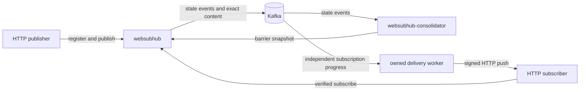

# WebSubHub

[](https://github.com/ayeshLK/websubhub/actions/workflows/ci.yml)
[](go.mod)
[](LICENSE)
[](#project-status)

**Make HTTP a complete, open event-broker interface across organizational
boundaries.**

WebSubHub is an open-source, self-hosted **HTTP Event Broker**. Publishers use
HTTP, WebSubHub owns durable event and subscription behavior, and verified
subscribers receive at-least-once HTTP push delivery. Kafka provides the
durable engine for the first Bring Your Own Broker (BYOB) profile without
leaking Kafka clients, offsets, consumer groups, or credentials into the public
product contract.

> [!IMPORTANT]
> WebSubHub is under active development and has not published a supported
> runtime release. The current `v0.5.0` target is a developer preview of the
> Kafka-backed **WebSub resource-topic** path. The CloudEvents event-stream API,
> renewal, lease expiry, and automatic ownership failover are not implemented
> yet. Do not treat the current branch as production-ready.

## Why WebSubHub?

Events often cross team, company, network, and technology boundaries.
Traditional brokers require broker-specific clients and network access, while
webhook systems repeatedly rebuild durability, verification, retry, progress,
dead-letter handling, and endpoint safety.

WebSubHub puts an HTTP-native boundary around those broker responsibilities:

- publishers and subscribers integrate with ordinary HTTP;
- callbacks are verified before a subscription becomes active;
- accepted content is persisted before durable acceptance is returned;
- each subscription owns independent delivery progress and retry behavior;
- provider details remain behind a capability-aware MessageStore contract;
- callback SSRF controls, JWT authorization, secret protection, health, and
  diagnostics are product responsibilities rather than application glue.

Delivery is deliberately **at least once**. Subscribers must handle duplicates
idempotently; WebSubHub does not claim end-to-end exactly-once delivery.

## Two explicit topic contracts

WebSubHub keeps resource distribution and immutable event streams distinct.

| Contract | Intended use | Status |
|---|---|---|
| **WebSub resource topic** | Distribute the current representation of a URL-addressed resource using the W3C WebSub lifecycle | Implemented by the `v0.5.0` preview |
| **CloudEvents event stream** | Distribute immutable events with broker-owned retention, progress, pause/resume, replay, and DLQ semantics | Public contract is gated and not implemented |

WebSub conformance claims apply only to relevant resource-topic behavior. The
optional publisher-to-hub extension is explicitly non-W3C behavior.

## Preview capabilities

The current implementation provides:

- two runnable Go services: `websubhub` and
  `websubhub-consolidator`;
- strict, process-specific TOML configuration with hierarchical
  `WEBSUBHUB__...` environment overrides;
- Kafka-backed provider-neutral MessageStore and MessageStore-backed
  StateStore behavior;
- deterministic state reduction, revisioned snapshots, and buffered hub
  startup without a snapshot/event gap;
- WebSub topic registration/deregistration and verified subscribe/unsubscribe
  lifecycle persistence;
- exact publisher payload and complete `Content-Type` preservation;
- sequential per-subscription delivery with stable message IDs and WebSub HMAC
  signatures;
- HTTP-managed or MessageStore-managed retry, stale state, HTTP `410 Gone`
  removal, and durable dead-letter handling;
- stable hub ownership so two hubs project all state while only the recorded
  owner delivers a subscription;
- JWT/JWKS authentication and scope authorization for public mutations and
  protected operations;
- callback policy enforcement at admission and DNS/IP dial time, redirect
  refusal, and bounded HTTP behavior;
- AES-256-GCM encryption of persisted subscription secrets;
- optional mTLS for hub-to-consolidator communication;
- liveness, readiness, capabilities, consolidator-authoritative topic and
  subscription inspection, and low-cardinality Prometheus text metrics;
- a repeatable two-hub acceptance topology using
  `apache/kafka:4.1.0`.

## Architecture



Every hub consumes the complete product state. A subscription's persisted
`server_id` selects its delivery owner in the preview; automatic takeover and
fencing are deferred.

## Quick start

### Prerequisites

- Go 1.25.8 or a newer supported Go release
- Docker with Compose v2
- OpenSSL
- GNU Make (optional, but used by the commands below)

Clone the repository:

```sh
git clone https://github.com/ayeshLK/websubhub.git
cd websubhub
```

To start the topology and keep it running while you register a topic, verify a
subscription, publish content, inspect delivery, and query operations, follow
the [interactive Docker Compose quickstart](docs/compose-quickstart.md).

To run the same topology as an automated acceptance test that cleans up after
itself:

```sh
make compose-smoke
```

The smoke test:

1. builds static local binaries;
2. generates ignored, two-day test credentials;
3. starts Kafka 4.1.0, the consolidator, two hubs, and a controlled
   JWT/subscriber fixture;
4. exercises authentication, registration, verification, exact content,
   signed delivery, retry, DLQ, stale/removal behavior, cross-hub projection,
   and owner restart recovery;
5. removes its containers, network, and Kafka volume when it exits.

Generated local credentials remain under
`deploy/compose/.generated/` and must never be reused outside this test
topology.

## Build

Build both services:

```sh
make build
./bin/websubhub --version
./bin/websubhub-consolidator --version
```

Build metadata can be supplied explicitly:

```sh
make build VERSION=v0.5.0-dev COMMIT=local BUILD_DATE=2026-08-27T00:00:00Z
```

The binaries accept a process-specific TOML file:

```text
websubhub --config /path/to/websubhub.toml
websubhub-consolidator --config /path/to/websubhub-consolidator.toml
```

Start Kafka and the consolidator before the hub. The files under
[`configs/`](configs/) are secure configuration templates, not immediately
runnable credentials; copy and adapt them for your broker, identity provider,
TLS identities, and secret mounts.

## Release distributions

Both components share one product version but are packaged and deployed
independently. Every release provides separate `websubhub` and
`websubhub-consolidator` archives for Linux, macOS, and Windows on `amd64` and
`arm64`. An extracted archive has this shape:

```text
<component>_<version>_<os>_<arch>/
├── bin/<component>[.exe]
├── config/<component>.toml
├── README.md
├── LICENSE
└── NOTICE
```

The included TOML is a secure template rather than runnable credentials. Start
Kafka, then the consolidator, then one or more hubs. Use the same release
version for both processes.

Production container targets are published separately for Linux `amd64` and
`arm64`:

```sh
docker pull ayeshalmeida/websubhub:0.5.0
docker pull ayeshalmeida/websubhub-consolidator:0.5.0

docker run --rm ayeshalmeida/websubhub:0.5.0 --version
docker run --rm ayeshalmeida/websubhub-consolidator:0.5.0 --version
```

These commands become available when `v0.5.0` is published; the repository has
not yet published that preview. Runtime deployments must mount the appropriate
configuration and secret files and provide Kafka/network connectivity. Images
run as non-root and intentionally contain only their component application
binary.

Release assets include SHA-256 checksums, per-archive SPDX JSON SBOMs, keyless
Sigstore signatures, and provenance attestations. Initial macOS and Windows
artifacts do not have native platform signing; that roadmap item is tracked in
[issue #7](https://github.com/ayeshLK/websubhub/issues/7). See the
[installation and deployment guide](docs/installing.md) for binary and
container usage. Maintainers should use the [release guide](docs/releasing.md)
for local dry runs and the publication checklist.

## Test

Run the appropriate level of validation:

| Command | Coverage |
|---|---|
| `make test` | Shuffled Go unit and package tests |
| `make check` | Formatting, generated drift, source headers, vet, shuffled tests, race detector, dependency licenses, and documentation links |
| Kafka conformance command below | Provider contract against a real Kafka broker |
| `make compose-smoke` | Full two-hub Kafka acceptance topology |

Run the Kafka provider conformance suite against an existing broker:

```sh
WEBSUBHUB_TEST_KAFKA_BROKERS=127.0.0.1:9092 \
  go test -v -run '^TestKafkaConformance$' \
  ./internal/persistence/messagestore/kafka
```

For focused development, standard Go tooling also works:

```sh
go test ./internal/delivery
go test -race ./...
go vet ./...
```

CI tests the configured Go version matrix and additionally runs Kafka provider
conformance, vulnerability scanning, and secret scanning. Third-party GitHub
Actions are pinned to immutable commit SHAs.

## Configuration

WebSubHub uses two strict configuration roots:

- [`configs/websubhub.example.toml`](configs/websubhub.example.toml) configures
  the public and operations listeners, stable server ID, JWT policy, callback
  safety, subscription-secret provider, state projection, consolidator client,
  delivery, and Kafka MessageStore.
- [`configs/websubhub-consolidator.example.toml`](configs/websubhub-consolidator.example.toml)
  configures the internal snapshot service, state behavior, authentication,
  and Kafka MessageStore.

Unknown keys, incomplete security settings, invalid retry combinations, and
settings owned by the other process are rejected. Environment variables
override leaf fields using double underscores:

```sh
WEBSUBHUB__SERVER__ID=hub-b
WEBSUBHUB__SERVER__PUBLIC_URL=https://hub-b.example.com/websub
WEBSUBHUB__MESSAGE_STORE__KAFKA__BROKERS='["kafka-1:9092","kafka-2:9092"]'
```

Kafka TLS and SASL credentials are loaded through file references rather than
inline example secrets. Hub-to-consolidator authentication is either `mtls`
or `none`; mTLS is recommended, while `none` is intended only for an
isolated trusted network.

## HTTP and operations surfaces

The hub path comes from `server.public_url`. Operational endpoints are served
on the separate `operations.listen` listener:

| Endpoint | Authentication | Purpose |
|---|---|---|
| `GET /health/live` | None | Process liveness |
| `GET /health/ready` | None | Bounded state-projection readiness |
| `GET /v1/system/capabilities` | JWT operations scope | Effective provider and preview capabilities |
| `GET /v1/topics` | JWT operations scope | Bounded canonical topic summaries |
| `GET /v1/topics/{id}` | JWT operations scope | Safe canonical topic detail |
| `GET /v1/subscriptions` | JWT operations scope | Bounded canonical subscription summaries |
| `GET /v1/subscriptions/{id}` | JWT operations scope | Safe canonical subscription detail |
| `GET /metrics` | JWT operations scope | Prometheus-compatible bounded metrics |

The topic and subscription routes are an internal preview contract for a
future control-plane BFF, not a supported public customer administration API.
Their revision comes from the consolidator's canonical materialized snapshot;
StateStore events remain the durable source of truth. Management visibility
does not guarantee that a particular hub's local admission projection has
caught up. Consolidator failure returns `503` without a local-projection
fallback. Collection limits are bounded to 100; cursor pagination is reserved
but not implemented in v0.5.

Public protocol and operations mutations do not have an unauthenticated mode
in the preview. Configure an exact issuer, audience, HTTPS JWKS URL, asymmetric
algorithm allowlist, and operation scopes.

## Repository layout

```text
cmd/                              service entry points
configs/                          process-specific configuration examples
deploy/compose/                   local Kafka preview topology
docs/architecture/decisions/     accepted ADRs and open gates
docs/installing.md                release installation and deployment guide
packaging/                        per-component release contents
scripts/                          release layout verification
internal/app/                     composition roots and protocol adapter
internal/persistence/             MessageStore, Kafka, and StateStore
internal/delivery/                per-subscription delivery behavior
internal/security/                JWT, callback policy, and secret protection
test/acceptance/                  end-to-end Compose acceptance test
```

## Project status

The repository has completed the implementation slices through the Kafka
Compose acceptance topology and now includes guarded release foundations for
independent six-platform archives and the two Docker Hub images. No runtime
release has been published. Work remaining before the first developer preview
includes expanded failure qualification, operational wiring, repository
release-environment setup, and an end-to-end release-candidate rehearsal.

Later releases add the gated CloudEvents event-stream contract, renewal and
lease expiry, automatic ownership transfer and fencing, richer administration,
production packaging and recovery qualification, and eventually additional
persistence profiles.

See the [architecture decisions](docs/architecture/decisions/README.md) for
accepted behavior and unresolved gates.

## Contributing

WebSubHub welcomes issues, design feedback, documentation improvements, and
tested code changes. Read [CONTRIBUTING.md](CONTRIBUTING.md) before proposing a
public HTTP contract, persisted schema, provider capability, or security
boundary change.

Please report security vulnerabilities privately as described in
[SECURITY.md](SECURITY.md), not through a public issue.

## License

WebSubHub is licensed under the [Apache License 2.0](LICENSE). See
[`NOTICE`](NOTICE) for attribution notices.
